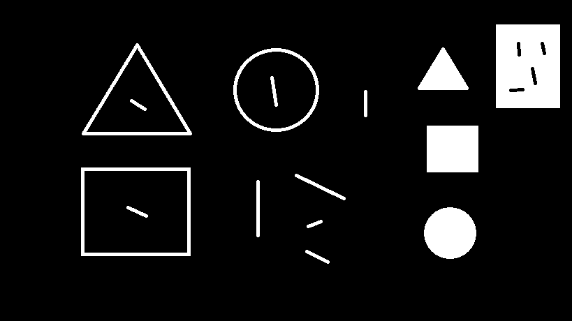
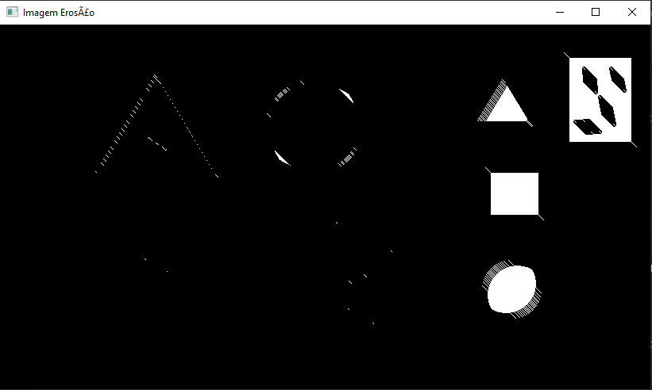
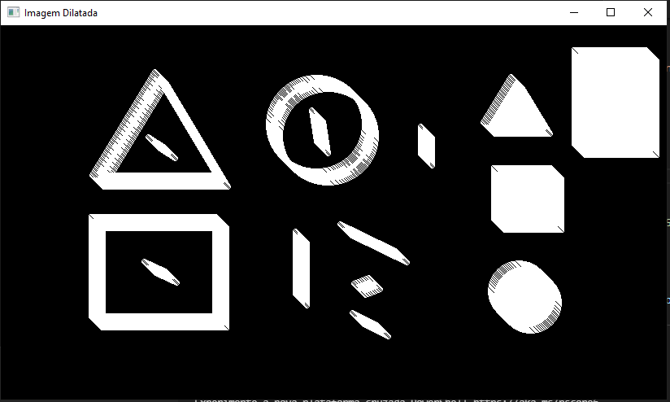
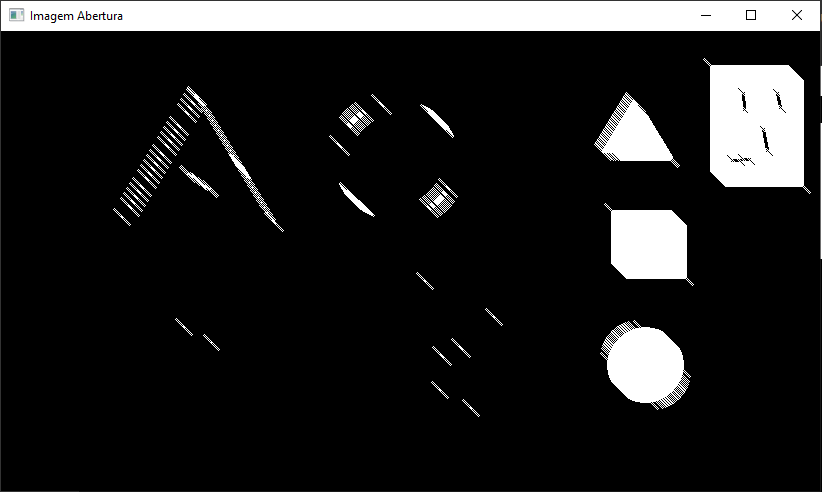
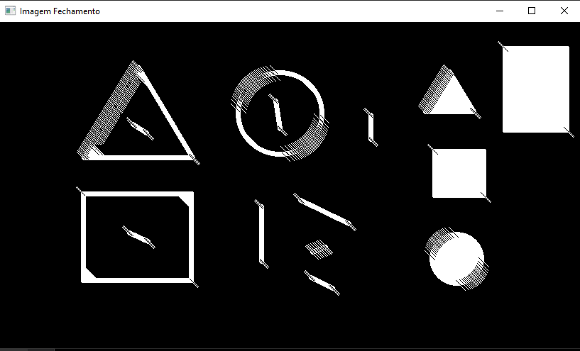

# Processamento Morfológico

#### 🏫 Universidade Federal de Alagoas - UFAL *Ciência da Computação* - *Campus. Arapiraca*.

#### 📽 Projeto Final da disciplina de Processamento de Imagens
* Professor:
    👨‍🏫Tácito Trindade de Araújo Tiburtino Neves
* Aluno:
    👨‍🎓Franklyn Roberto da Silva

### 🔴Descrição geral do projeto
O objetivo principal do trabalho é avaliar de forma prática o entendimento dos conceitos apresentados.
Este projeto contém algorítmos operações morfológicas nas imagens que são: Dilatação, Erosão, Abertura e Fechamento.

Algumas coisas tem base nesse site: https://docs.opencv.org/master/d9/d61/tutorial_py_morphological_ops.html

### ⚠Onde foi rodado o algoritimo❔
> Notebook
>
> Windows 10 Home, Versão: 21H1
>
> Fabricante do sistema: Dell Inc.
> 
> Modelo do sistema: Inspirion 3442
> 
> BIOS: A15
> 
> Versão do DirectX 12
> 
> Processador: Intel(R) Core(TM) i5-4210U CPU @ 1.70GHz (4 CPUs), 1.70 GHz
> 
> Placa de vídeo: NVIDIA GeForce 820M, VRAM 2 GB
> 
> Memória RAM: 8 Gb 

### ⚠O que precisa para rodar o algoritimo❔
* Ambiente Windows 10
* Python 3.9.5

Com o python instalado, precisa instalar uns pacotes para o projeto funcionar, que são:
> pip install numpy
> 
> pip install opencv-python
> 
> pip install pip install -U scikit-image

Após instalado os pacotes acima, execute o comando abaixo para inicializar o projeto.

>python .\Program.py

O algorítmos pode demorar um pouco, então aguarde exibir as telas com as imagens processadas.

⚠Obs: Toda implementação está nos respectivos arquivos no GitHub💢

### 🟠Como funciona o código❔
>O código permite a escolha de uma imagem como entrada,
e a saída do algoritmo será o resultado da aplicação das operações de morfologia: dilatação, erosão, abertura e fechamento.

# 🟢O funcionamento❕
### Teoria
As transformações morfológicas são algumas operações simples baseadas na forma da imagem. Normalmente é executado em imagens binárias. Ele precisa de duas entradas, uma é a nossa imagem original, a segunda é chamada de elemento estruturante ou kernel que decide a natureza da operação. Dois operadores morfológicos básicos são erosão e dilatação. Em seguida, suas formas variantes como abertura, fechamento, gradiente etc. também entram em jogo. Vamos vê-los um por um com a ajuda da seguinte imagem:


<p align="center">
    
</p>
Para realizar as operações de processamento morfológicos, na implementação é necessário ter uma imagem de preferência preto e branco.
Pois, no arquivo de entrada ([Program.py](Program.py)) realiza-se estes pré-requisitos para garantir a execução correta dos algorítmos.

```python

import cv2 as cv
from skimage import io
from Binario import imagemEmBinario
from ContornaImagem import imagemContornada
from OperacoesMorfologicas import dilatar, erosao, abertura, fechamento

caminhoDaImagens = "./imagens/" # Coloque aqui o caminho da imagem, é necessário ter uma imagem preto e branco, 
                                # para obter o contorno dessa imagem de entrada.

imagemOriginal = cv.cvtColor(io.imread(caminhoDaImagens + "nomeDaImagem.png"), cv.COLOR_RGBA2GRAY)
imagemBinaria = imagemEmBinario(imagemOriginal)

```
Aqui exibe a imagem original nesse método.

```python
cv.imshow('Imagem Original', imagemBinaria)
```

Aqui na classe ([Binario.py](Binario.py)), vai deixar a imagem em binário.
```python
import numpy as np

# deixa a imagem Binaria
def imagemEmBinario(image):
    imagemBinario = np.zeros(image.shape)
    for i in range(len(image)):
        for j in range(len(image[0])):
            if image[i, j] != 0:
                imagemBinario[i, j] = 255
    
    resultado = np.copy(imagemBinario) 
    
    return resultado
 ```
Aqui na classe ([ContornaImagem.py](ContornaImagem.py)), vai gerar uma imagem contornada.
```python
import numpy as np
from skimage.measure import find_contours
import cv2 as cv

# gerar uma imagem contornada
def imagemContornada(imagem):
    contornosDaImagem = np.zeros(imagem.shape + (3, ), np.uint8)

    contornos = find_contours(imagem, 0)

    for contorno in contornos:

        contorno = contorno.astype(np.int).tolist()
        
        # Aqui vai desenhar linhas de contorno
        for idx, coords in enumerate(contorno[:-1]):
            y1, x1, y2, x2 = coords + contorno[idx + 1]
            contornosDaImagem = cv.line(contornosDaImagem, (x1, y1), (x2, y2),(0, 255, 0), 1)
        
    contornosDaImagem = contornosDaImagem[:,:,1]

    return contornosDaImagem
```

Aqui na classe ([OperacoesMorfologicas.py](OperacoesMorfologicas.py)), no método <b> *EROSÃO* </b>, a ideia básica de erosão é apenas como a erosão do solo, ela desgasta os limites do objeto em primeiro plano (sempre tente manter o primeiro plano em branco). Então, o que isso faz? O kernel desliza pela imagem (como na convolução 2D). Um pixel na imagem original (1 ou 0) será considerado 1 apenas se todos os pixels sob o kernel forem 1, caso contrário, ele é corroído (reduzido a zero).

Então o que acontece é que todos os pixels próximos ao limite serão descartados dependendo do tamanho do kernel. Assim, a espessura ou o tamanho do objeto em primeiro plano diminui ou simplesmente a região branca diminui na imagem. É útil para remover pequenos ruídos brancos, destacar dois objetos conectados, etc.
<p align="center">
    
</p>

```python
import numpy as np
from ContornaImagem import imagemContornada

def erosao(imagem, oElementoEstruturante, contornosDeImagem):

    imagemQueIrarTerErosao = imagem
    # correção é para não aplicar o elemento estruturante errado.
    correcao = int(len(oElementoEstruturante)/2)

    # Aqui irá percorre a imagem
    for i in range(len(imagemQueIrarTerErosao)):
        for j in range(len(imagemQueIrarTerErosao[0])):

            #Se for uma borda, aplica-se logo mais o elemento estruturante com o pixel branco, por exemplo (255)
            if contornosDeImagem[i, j] == 255:

                for k in range(len(oElementoEstruturante)):
                    for l in range(len(oElementoEstruturante[0])):

                         # Confere se o elemento estruturante está contido na matriz
                        if oElementoEstruturante[k, l] != 0:
                            try:
                                # Aplicando a transformação - neste caso fazendo a erosão (desgastando). 
                                imagemQueIrarTerErosao[i + k - correcao, j + k - correcao] = 0
                            except:
                                pass
    return imagemQueIrarTerErosao
```


Aqui na classe ([OperacoesMorfologicas.py](OperacoesMorfologicas.py)), no método <b> *DILATAÇÃO* </b>, aqui um elemento de pixel é '1' se pelo menos um pixel sob o kernel for '1'. Portanto, aumenta a região branca na imagem ou o tamanho do objeto em primeiro plano aumenta. Normalmente, em casos como remoção de ruído, a erosão é seguida de dilatação. Porque, a erosão remove ruídos brancos, mas também encolhe nosso objeto. Então, nós dilatamos. Como o ruído acabou, eles não voltarão, mas nossa área de objeto aumenta. Também é útil para juntar partes quebradas de um objeto.
<p align="center">
    
</p>


```python
import numpy as np
from ContornaImagem import imagemContornada

def dilatar(imagem, oElementoEstruturante, contornosDeImagem):

        dilitarAImagem = imagem 
        # correção é para não aplicar o elemento estruturante errado.
        correcao = int(len(oElementoEstruturante)/2)  

        # Aqui irá percorre a imagem
        for i in range(len(dilitarAImagem)):
            for j in range(len(dilitarAImagem[0])):

                #Se for uma borda, aplica-se logo mais o elemento estruturante com o pixel branco, por exemplo (255)
                if contornosDeImagem[i, j] == 255:

                    for k in range(len(oElementoEstruturante)):
                        for l in range(len(oElementoEstruturante[0])):

                            # Confere se o elemento estruturante está contido na matriz
                            if oElementoEstruturante[k, l] != 0:
                                try:
                                    # Aplicando a transformação - neste caso pintando de branco (dilatando). 
                                    dilitarAImagem[i + k - correcao, j + k - correcao] = 255
                                except:
                                    pass

        return dilitarAImagem 
```

Aqui na classe ([OperacoesMorfologicas.py](OperacoesMorfologicas.py)), no método <b> *ABERTURA* </b>, aqui na Abertura, é apenas outro nome de erosão seguida de dilatação . É útil na remoção de ruído, conforme explicado acima. 
<p align="center">
    
</p>


```python
import numpy as np
from ContornaImagem import imagemContornada


def abertura(imagem, oElementoEstruturante, contornosDeImagem):
    copiaDaImagem = np.copy(imagem)
    imagemComErosao = erosao(copiaDaImagem, oElementoEstruturante, contornosDeImagem)
    imagemComContornacao = imagemContornada(imagemComErosao)
    imagemComAbertura = dilatar(imagemComErosao, oElementoEstruturante, imagemComContornacao)

    return imagemComAbertura

```
Aqui na classe ([OperacoesMorfologicas.py](OperacoesMorfologicas.py)), no método <b> *FECHAMENTO* </b>, o Fechamento é o reverso da abertura, dilatação seguida por erosão . É útil para fechar pequenos orifícios dentro dos objetos em primeiro plano ou pequenos pontos pretos no objeto.
<p align="center">
    
</p>


```python
import numpy as np
from ContornaImagem import imagemContornada

def fechamento(imagem, oElementoEstruturante, contornosDeImagem):
    copiaDaImagem = np.copy(imagem)
    imagemComdilatacao = dilatar(copiaDaImagem, oElementoEstruturante, contornosDeImagem)
    imagemComContornacao = imagemContornada(imagemComdilatacao)
    imagemComFechamento = erosao(imagemComdilatacao, oElementoEstruturante, imagemComContornacao)

    return imagemComFechamento
```
Voltando ao programa principal ([Program.py](Program.py)), o elemento estruturante se dá pela ferramenta do open-cv.

```python
oElementoEstruturante = cv.getStructuringElement(cv.MORPH_ELLIPSE, (15,15))
```
Que é possível definir as dimensões do mesmo na tupla para que a depender da imagem obtenha-se um melhor resultado.

Aqui abaixo, são as chamadas dos metódos.

```python
# OPERAÇÕES DE EROSÃO E DILATAÇÃO
img_erodida = erosao(imagemBinaria, oElementoEstruturante, imagemComContorno)
cv.imshow('Imagem Erosão', img_erodida)

img_dilatada = dilatar(imagemBinaria, oElementoEstruturante, imagemComContorno)
cv.imshow('Imagem Dilatada', img_dilatada)


# OPERAÇÕES ABERTURA E FECHAMENTO

imagemComAbertura = abertura(imagemBinaria, oElementoEstruturante, imagemComContorno)
cv.imshow('Imagem Abertura', imagemComAbertura)

imagemComFechamento = fechamento(imagemBinaria, oElementoEstruturante, imagemComContorno)
cv.imshow('Imagem Fechamento', imagemComFechamento)

cv.waitKey(0)
```
### 🔵Resultados❕

<p align="left">
    Fiz uma imagem usando Paint do Windows 10 e salvei como ImagemOriginal.png
    
</p>
<h3 align="left"> Desenhei isso aqui ⤵ </h3>
<p align="left">
    
</p>
E o resultado de cada operação de transformações morfológicas, foi essas:
<p align="left">
    <h3 align="left"> Erosão: </h3>
    
</p>
<p align="left">
    <h3 align="left"> Dilatação: </h3>
    
</p>
<p align="left">
    <h3 align="left"> Abertura: </h3>
    
</p>
<p align="left">
    <h3 align="left"> Fechamento: </h3>
    
</p>
